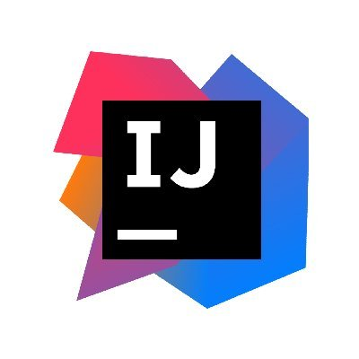

##  Moin Moin, I'm <a href="https://github.com/pmSven" target="_blank">Sven Maack</a>! 

I am a passionate software engineer and technology enthusiast who is always looking for new challenges and fresh inspiration.
My main focus is the development and conception of e-commerce challenges and individual enterprise solutions.

<!--### 👨🏻‍💻 &nbsp;About Me-->

 

### 🛠 &nbsp; Languages

 
 

### 🛠 &nbsp; Frameworks

 
 

### 🛠 &nbsp; Tools

 
 

 
 

---

---

<i>Random dev joke for you!</i> 

---

### Let's Connect :coffee:

<!--
**pmSven/pmSven** is a ✨ _special_ ✨ repository because its `README.md` (this file) appears on your GitHub profile.

